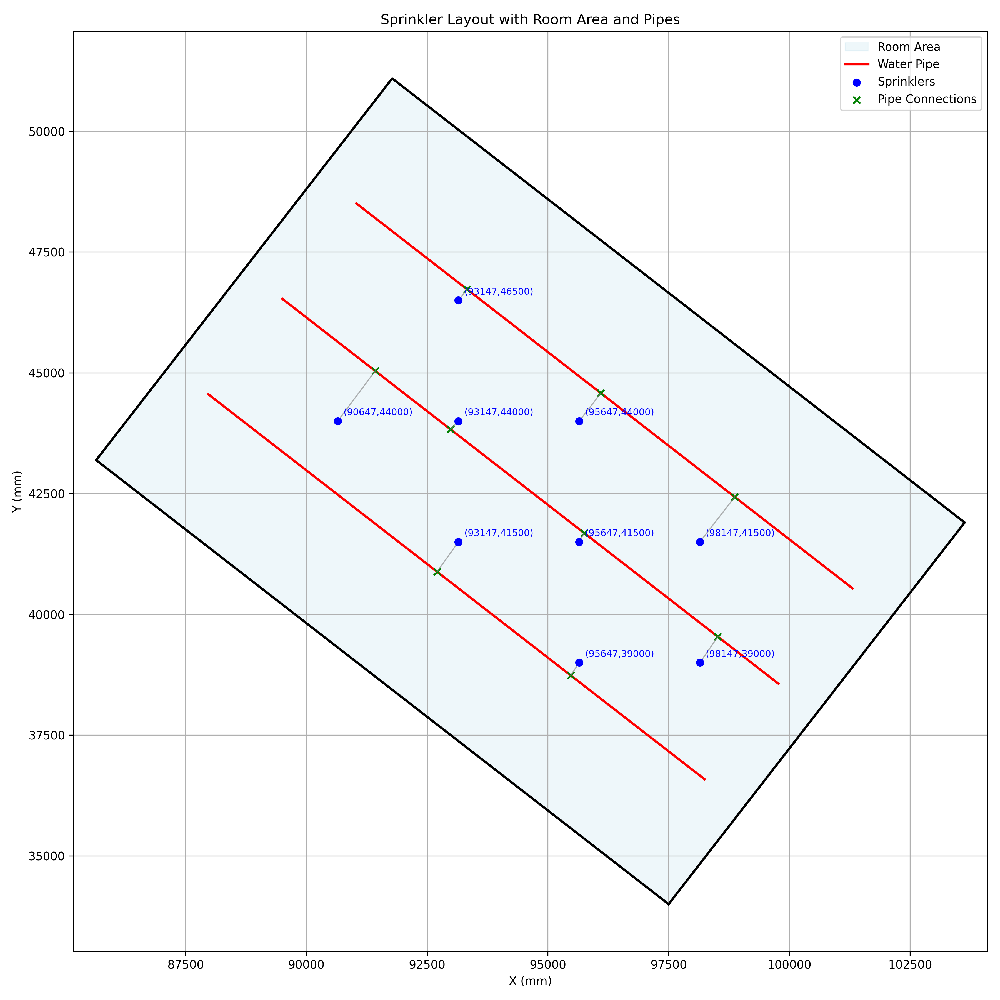

# Sprinkler Planner

Sprinkler Planner is a modular C# .NET 8.0 application that calculates optimal sprinkler placements in a 3D-defined room and connects each sprinkler to its nearest pipe segment. It is built using clean, industry-standard layered architecture with a strong focus on separation of concerns, dependency injection, and structured logging via Serilog.

Designed for extensibility and testability, the project includes full unit test coverage using xUnit, structured console and file logging, and CSV export functionality. Ideal for demonstrating geometry processing, service-oriented design, and clean .NET practices.


---

## Key Features

- 3D modeling of room geometry and pipe layouts using precise spatial representations
- Automated sprinkler placement with configurable minimum spacing (default: 2.5 meters)
- Accurate nearest pipe point computation using 3D vector projection on line segments
- Structured and extensible logging using Serilog (console + rolling file output)
- CSV export and formatted console output of all sprinkler-to-pipe connections
- Clean separation of concerns using layered architecture:
  - Domain (core logic and models)
  - Infrastructure (service and I/O implementations)
  - Application (runner and configuration)
  - Test (unit tests for core and infrastructure layers)
- Full dependency injection setup via `Microsoft.Extensions.DependencyInjection`
- Unit tested with `xUnit` to ensure correctness of placement, geometry, and data loading logic

---

## Technology Stack

- .NET 8.0 Console Application (C# 12)
- Dependency Injection using `Microsoft.Extensions.DependencyInjection`
- Structured logging with Serilog (console and file sinks)
- Logging abstraction via `ILogger<T>` for flexibility and testability
- CSV export using built-in file I/O operations
- Unit testing with xUnit for core and infrastructure layers

## Architecture

This project follows a **layered architecture** separating concerns into:

1. **Core Layer**: Domain models and interfaces
2. **Infrastructure Layer**: Implementations (seeding, output, planning logic)
3. **Application Layer**: Entry point, dependency injection, orchestration
4. **Test Layer**: Unit tests for each layer

---

## Project Structure

```
SprinklerPlannerApp.sln
│
├── SprinklerPlannerApp/                 # Main application entry point
│   ├── Config/
│   │   └── ServiceRegistration.cs       # DI + Serilog setup
│   ├── Resources/
│   │   ├── output.csv
│   │   └── pipe.csv
│   │   ├── room.csv
│   │   └── sprinkler_distribution.png
│   ├── Runner/
│   │   └── AppRunner.cs
│   ├── Visualization/
│   │   └── visualize.py
│   └── Program.cs
│
├── SprinklerPlannerApp.Core/
│   ├── Domain/
│   │   ├── Point3D.cs
│   │   ├── LineSegment.cs
│   │   └── Room.cs
│   └── Interfaces/
│       ├── IOutputPrinter.cs
│       ├── IPipeDataSeeder.cs
│       ├── IRoomDataSeeder.cs
│       └── ISprinklerPlannerService.cs
│
├── SprinklerPlannerApp.Infrastructure/
│   ├── Data/
│   │   ├── PipeDataSeeder.cs
│   │   └── RoomDataSeeder.cs
│   ├── Output/
│   │   └── ConsoleOutputPrinter.cs
│   └── Services/
│       └── SprinklerPlannerService.cs
│
├── SprinklerPlannerApp.Tests/
│   ├── Core/Domain/
│   │   ├── Point3DTests.cs
│   │   ├── LineSegmentTests.cs
│   │   └── RoomTests.cs
│   └── Infrastructure/
│       ├── Data/
│       │   ├── PipeDataSeederTests.cs
│       │   └── RoomDataSeederTests.cs
│       ├── Output/
│       │   └── ConsoleOutputPrinterTests.cs
│       └── Services/
│           └── SprinklerPlannerServiceTests.cs
│
├── .gitignore
├── README.md
└── LICENSE (optional)
```

---

## Logging with Serilog

Logging is implemented using Serilog with sinks for:

- Console (custom template)
- File output (`Logs/sprinklers.log`, daily rolling)

Configured in `ServiceRegistration.cs`:

```csharp
Log.Logger = new LoggerConfiguration()
    .MinimumLevel.Information()
    .WriteTo.Console(outputTemplate: "{Message:lj}{NewLine}")
    .WriteTo.File("Logs/sprinklers.log", rollingInterval: RollingInterval.Day)
    .CreateLogger();
```

Logs are injected using `ILogger<T>` and handled via DI.

---


## Dependency Injection

The application uses Microsoft's built-in `DependencyInjection` container to manage object creation and service lifetimes. All dependencies are registered in the `ServiceRegistration.cs` file to ensure modularity, testability, and loose coupling between components.

### Registered Services

```csharp
ISprinklerPlannerService   →   SprinklerPlannerService
IOutputPrinter             →   ConsoleOutputPrinter
IRoomDataSeeder            →   RoomDataSeeder
IPipeDataSeeder            →   PipeDataSeeder
Room                      (Singleton)
List<LineSegment>         (Singleton)
```

### Description

- `ISprinklerPlannerService` → Handles core sprinkler placement logic and nearest pipe computation  
- `IOutputPrinter` → Responsible for displaying results in the console  
- `IRoomDataSeeder` → Loads room boundary data from `room.csv`  
- `IPipeDataSeeder` → Loads pipe segment data from `pipe.csv`  
- `Room` (singleton) → Holds the 3D room geometry used in placement calculations  
- `List<LineSegment>` (singleton) → Contains pipe segments used to compute nearest connections

All services are registered as **singletons** to maintain consistent shared state across the application's lifecycle.

---

### Sample Output (Info Level)

```
Sprinkler Planner Service initialized successfully with 3 pipes.
Commencing sprinkler placement process...
Sprinkler placement process completed successfully.
Total Sprinklers Placed: 9
Sprinkler: (90647.67, 44000.00, 2500.00) → Pipe: (91425.36, 45039.84, 3093.60)
Sprinkler: (93147.67, 41500.00, 2500.00) → Pipe: (92706.11, 40882.46, 3269.47)
Sprinkler: (93147.67, 44000.00, 2500.00) → Pipe: (92983.92, 43830.90, 3169.47)
Sprinkler: (93147.67, 46500.00, 2500.00) → Pipe: (93325.80, 46729.65, 3000.00)
Sprinkler: (95647.67, 39000.00, 2500.00) → Pipe: (95473.61, 38735.77, 3134.76)
Sprinkler: (95647.67, 41500.00, 2500.00) → Pipe: (95751.42, 41684.21, 3304.18)
Sprinkler: (95647.67, 44000.00, 2500.00) → Pipe: (96097.39, 44579.78, 3000.00)
Sprinkler: (98147.67, 39000.00, 2500.00) → Pipe: (98518.91, 39537.52, 3438.89)
Sprinkler: (98147.67, 41500.00, 2500.00) → Pipe: (98868.99, 42429.92, 3000.00)
CSV report saved to SprinklerPlannerApp/Resources/output.csv
Sprinkler planning complete. Results exported.

```

---

## CSV Output

CSV file is generated at:
```
SprinklerPlannerApp/Resources/output.csv
```

Format:
```
SprinklerX,SprinklerY,SprinklerZ,PipeX,PipeY,PipeZ
90647.67,44000,2500,91425.36184633496,45039.84419323879,3093.603483949829
93147.67,41500,2500,92706.10975043457,40882.458598792975,3269.4701547976215
93147.67,44000,2500,92983.91830722948,43830.90352986806,3169.467723806221
93147.67,46500,2500,93325.80175370461,46729.64623022053,3000
...
```

---

### Sprinkler Placement Visualization

You can visualize the sprinkler placements in a 2D top-down view using the provided Python script. This helps to understand the distribution and coverage of the sprinklers within the room.

### Run the Visualization Script

```bash
python3 SprinklerPlannerApp/Visualization/visualize.py
```

Make sure you have the required Python packages installed:

```bash
pip install matplotlib pandas
```

### Output Preview

The script generates and saves an image like this:



The image shows:
- **Blue dots**: Sprinkler positions
- **Red lines**: Pipe connections
- **Black polygon**: Room boundary
---

## How to Run

```bash
# Clone the repo
git clone https://github.com/ShabrinaMim/SprinklerPlannerApp.git
cd SprinklerPlannerApp

# Run the application
dotnet run --project SprinklerPlannerApp/SprinklerPlannerApp.csproj
```

---

## Running Tests

```bash
dotnet test
```

All domain and infrastructure components are covered by `xUnit` test cases.

---

## License

This project is licensed under the MIT License.

---

## Author

**Shabrina Mim**  
GitHub: [https://github.com/ShabrinaMim/SprinklerPlannerApp.git](https://github.com/ShabrinaMim)